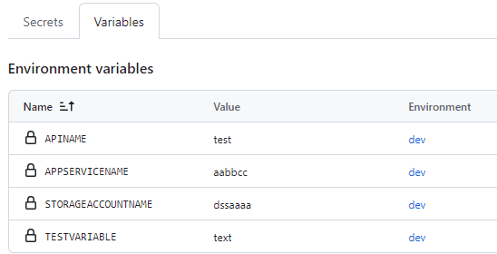

# Replace token

Simple GitHub Action to replace tokens in files. This action can fetch variables stored in Github variables (repository variables, org variables and enviornment variables) and replace them in desired files. 

Please note that variable substitution is case sensitive, please try to store tokens in uppercase in Tokenized files.

## Inputs

- `gh-token` - Github Token or Pat Token (Required)
- `Environment-Name` - Environment Name, this is required to fetch environment variables from Github Environment (Optional)
- `Org-Name` - organization Name - This is required to fetch org level variable values (Optional)
- `tokenprefix` - Token prefix, default is `#{` (Optional)
- `tokensuffix` - Token suffix, default is `}#` (Optional)
- `Filespath` - file path of tokenized files (Required)
- `Filename` - tokenized file name, single file or extenstion eg, .json, .xml (Required)

## Example

If you want to replace `#{APPNAME}#` in tokenized files, add the action to your workflow like this:

```yml

jobs:
  build-and-deploy:
    runs-on: ubuntu-latest
    
    steps:
    - name: 'Checkout Github Action' 
      uses: actions/checkout@4

    - uses: vinayaja/replace-token@v1.0.0
      with:
        gh-token: ${{ secrets.PAT_TOKEN }} 
        Environment-Name: 'dev'  
        Filespath: ${{ github.workspace}}/files 
        FileName: '.json'
```
If you want to use a different token format, you can specify a custom token prefix/suffix. For example, to replace just tokens like `{APPLICATION}` you could add:

```yml

- uses: vinayaja/replace-token@v1.0.0
  with:
    gh-token: ${{ secrets.PAT_TOKEN }} 
    Environment-Name: 'dev'  
    Filespath: ${{ github.workspace}}/files 
    FileName: '.json'
    tokenprefix: '{'
    tokensuffix: '}'
```

### Example of tokenized json file

```json

{
    "$schema": "https://schema.management.azure.com/schemas/2015-01-01/deploymentParameters.json#",
    "contentVersion": "1.0.0.0",
    "parameters": {
        "paramAPPServiceName": {
            "value": "#{APPSERVICENAME}#"
        },
        "paramAPIName": {
            "value": "#{APINAME}#"
        },
        "paramStorageAccountName": {
            "value": "#{STORAGEACCOUNTNAME}#"
        }
    }
}

```

### Example of variables store in github

